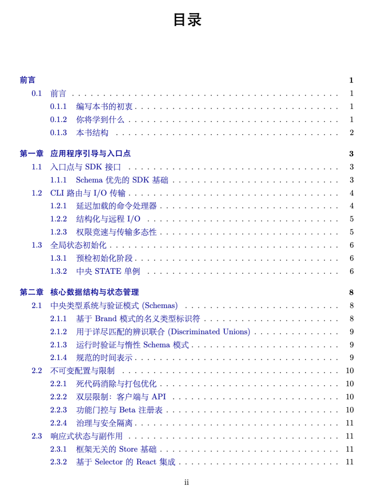

# Claude Code 手册
[English](README_en.md) | [简体中文](README.md)

我们自动化的生成了Claude Code Book: [ClaudeCodeBook-中文.pdf](book.pdf) | [ClaudeCodeBook-English.pdf](book_en.pdf)


## 概述
> Claude Code：由 Anthropic 构建的、由 AI 驱动的软件开发 CLI 智能体（命令行界面代理）。

Claude Code 是一个命令行界面工具，它将 Claude 的推理能力直接引入到开发工作流中。它提供了一个带有 AI 辅助的交互式 REPL（交互式解释器）、用于文件操作和命令执行的综合工具系统、Vim 风格的模式编辑，以及与开发工作流（Git、Shell 命令、编辑器）的深度集成。

该项目使用 TypeScript 编写，并以 Bun 作为运行时和构建工具。它面向多个平台（macOS、Linux、Windows），并支持多种身份验证方法，包括 OAuth、API 密钥以及云提供商集成（AWS Bedrock、Google Vertex AI）。

## 仓库结构

```
claude-code/
├── src/                          # 主应用程序源代码
│   ├── index.ts                  # 应用程序入口点
│   ├── commands.ts               # 斜杠命令注册与加载
│   ├── context.ts                # AI 上下文准备（系统/用户提示词）
│   ├── cost-tracker.ts           # API 使用量追踪与成本报告
│   ├── tools.ts                  # 工具注册与 MCP 集成
│   │
│   ├── commands/                  # 斜杠命令实现（约 40 个命令）
│   │   ├── add.ts                 # 使用 AI 添加/编辑代码
│   │   ├── autofixPr.ts          # 自动修复 Pull Request
│   │   ├── bash.ts               # Shell 命令执行
│   │   ├── config.ts             # 配置管理
│   │   ├── diff.ts               # Git 差异查看器
│   │   ├── git.ts                # Git 操作
│   │   └── ...
│   │
│   ├── tools/                     # AI 智能体的工具实现
│   │   ├── BashTool.ts
│   │   ├── FileReadTool.ts
│   │   ├── WebSearchTool.ts
│   │   ├── AgentTool.ts
│   │   └── ...
│   │
│   ├── utils/                     # 共享实用工具（约 40 个子目录）
│   │   ├── bash/                  # Shell 解析、安全性、执行
│   │   │   ├── exec.ts           # 命令执行引擎
│   │   │   ├── parser.ts         # Shell 解析实用工具
│   │   │   ├── security.ts       # 命令安全验证
│   │   │   └── shellSnapshot.ts  # Shell 状态捕获
│   │   ├── git/                  # Git 操作
│   │   ├── settings/             # 配置持久化
│   │   ├── analytics/            # 会话分析与 BigQuery 导出
│   │   ├── telemetry/            # OpenTelemetry 追踪与指标
│   │   ├── teleport/             # 远程会话 API 客户端
│   │   ├── vim/                  # Vim 模拟层
│   │   ├── todo/                 # Todo 数据类型
│   │   ├── ultraplan/            # Ultra-plan 工作流
│   │   └── ...
│   │
│   ├── bootstrap/                 # 应用程序初始化
│   │   └── state.ts              # 全局 STATE（状态）单例
│   │
│   ├── bridge/                    # 远程控制基础设施
│   │   ├── bridgeApi.ts          # 环境 REST API 客户端
│   │   ├── bridgeConfig.ts       # 带有 OAuth/keychain 的配置
│   │   ├── bridgeDebug.ts        # 用于测试的故障注入
│   │   └── workSecret.ts        # Work secret 解码与会话路由
│   │
│   ├── buddy/                     # 伙伴吉祥物系统
│   │   ├── companion.js          # 生物生成（基于种子的 PRNG）
│   │   ├── sprites.ts           # ASCII 艺术渲染
│   │   └── CompanionSprite.tsx  # React 虚拟形象组件
│   │
│   ├── assistant/                # Teleport Agent SDK
│   │   ├── entrypoints/         # SDK 入口点与类型
│   │   └── utils/               # 支持 OAuth 的 API 客户端
│   │
│   ├── voice/                     # 语音模式功能门控
│   │   └── voice-mode.ts        # GrowthBook + OAuth 身份验证检查
│   │
│   └── vim/                       # Vim 模拟
│       ├── transitions.ts        # 状态机（NORMAL/INSERT 模式）
│       ├── motions.ts           # 光标移动函数
│       ├── operators.ts         # 编辑操作（删除、复制等）
│       ├── textObjects.ts       # 文本对象边界
│       └── types.ts             # TypeScript 接口与常量
│
├── src/commands.ts               # 命令注册入口
├── src/tools.ts                  # 工具注册入口
├── src/context.ts                # 上下文准备入口
├── src/cost-tracker.ts           # 成本追踪入口
├── src/index.ts                   # 主入口点
│
├── package.json                  # Node.js 依赖
├── bunfig.toml                   # Bun 构建配置
├── tsconfig.json                 # TypeScript 配置
└── ...
```

## 开始使用

### 先决条件

- **Bun** ≥ 1.0 (通过 [bun.sh](https://bun.sh) 安装)
- **Node.js** ≥ 18 (作为后备方案)
- **macOS** / **Linux** / **Windows** (支持 WSL)

### 安装

```bash
# 克隆仓库
git clone https://github.com/anthropics/claude-code.git
cd claude-code

# 使用 Bun 安装依赖
bun install

# 构建项目
bun run build

# 链接以进行开发
bun link
```

### 开发环境设置

```bash
# 在支持热重载的开发模式下运行
bun run dev

# 运行测试
bun test

# 带有调试输出运行
DEBUG=* bun run start
```

### 环境变量

| 变量 | 说明 | 默认值 |
|----------|-------------|---------|
| `ANTHROPIC_API_KEY` | Anthropic API 密钥 | API 密钥认证必需 |
| `DEBUG` | 启用调试日志 | - |
| `BUN_ENV` | 环境 (`development`, `production`) | `production` |
| `OTEL_LOG_USER_PROMPTS` | 在遥测中包含用户提示词 | `false` |
| `BETA_SESSION_TRACING` | 启用测试版追踪属性 | `false` |

## 用法

### 基本命令

```bash
# 启动交互式会话
claude

# 以特定任务启动
claude "Explain this codebase"

# 以自动批准模式启动（用于自动化）
claude --approve-all "Review and fix bugs"

# 恢复之前的会话
claude --resume <session-id>
```

### 斜杠命令

可在交互式 REPL 中使用：

| 命令 | 说明 |
|---------|-------------|
| `/add [description]` | 根据描述添加或编辑代码 |
| `/bash <command>` | 执行 Shell 命令 |
| `/diff [file]` | 显示未提交的更改 |
| `/git <subcommand>` | 运行 git 命令 |
| `/config [key] [value]` | 查看或修改配置 |
| `/clear` | 清除对话 |
| `/help` | 显示帮助信息 |
| `/model <name>` | 切换活动模型 |
| `/compact` | 压缩上下文窗口 |
| `/session` | 显示当前会话信息 |

### 配置

```bash
# 查看当前配置
claude config list

# 设置配置值
claude config set model claude-opus-4-5

# 设置环境变量
claude config set --env API_KEY your_key
```

## 关键模块与脚本

### 核心入口点

| 文件 | 用途 |
|------|---------|
| `src/index.ts` | 主入口点；编排初始化、会话管理以及 REPL 循环 |
| `src/commands.ts` | 所有斜杠命令的中央注册表，包含功能门控加载 |
| `src/tools.ts` | 工具注册表，组装内置工具、MCP 工具和经过权限过滤的工具 |
| `src/context.ts` | 为 AI 对话准备系统和用户上下文 |
| `src/cost-tracker.ts` | 追踪 API 使用量、成本，并生成使用情况报告 |

### 状态管理

| 模块 | 用途 |
|--------|---------|
| `src/bootstrap/state.ts` | 全局 STATE 单例，带有所有运行时状态的类型化访问器 |
| `src/utils/settings/settings.ts` | 项目级配置持久化 |

### 安全与 Bash 执行

| 模块 | 用途 |
|--------|---------|
| `src/utils/bash/security.ts` | 默认拒绝的安全模型；拒绝无法验证的 Shell 结构 |
| `src/utils/bash/exec.ts` | 带有流式传输、超时和取消功能的命令执行 |
| `src/utils/bash/shellSnapshot.ts` | 捕获 Shell 状态以供上下文注入 |

### 遥测与分析

| 模块 | 用途 |
|--------|---------|
| `src/utils/telemetry/index.ts` | 用于 OpenTelemetry 追踪和指标的公共 API |
| `src/utils/telemetry/sessionTracing.ts` | 交互、LLM 调用和工具的 Span（跨度）管理 |
| `src/utils/telemetry/bigqueryExporter.ts` | 将指标导出到 BigQuery |
| `src/utils/analytics/sessionAnalytics.ts` | 会话级分析与 BigQuery 导出 |

### Vim 模拟

| 模块 | 用途 |
|--------|---------|
| `src/vim/transitions.ts` | 协调 NORMAL/INSERT（正常/插入）模式的状态机 |
| `src/vim/motions.ts` | 用于光标移动的纯函数 |
| `src/vim/operators.ts` | 用于编辑操作的纯函数 |
| `src/vim/textObjects.ts` | 用于文本对象边界的函数 |
| `src/vim/types.ts` | TypeScript 接口和状态类型定义 |

### 远程与云端功能

| 模块 | 用途 |
|--------|---------|
| `src/bridge/bridgeApi.ts` | 用于远程控制的环境 REST API 客户端 |
| `src/bridge/bridgeConfig.ts` | 带有 OAuth 和钥匙串（keychain）集成的配置 |
| `src/assistant/` | 用于会话管理的 Teleport Agent SDK |
| `src/utils/teleport/api.ts` | 远程环境的 Sessions API 客户端 |

## 架构

### 系统架构

```
┌─────────────────────────────────────────────────────────────────┐
│                           CLI 界面                              │
│   用户输入 → 斜杠命令 → REPL → Vim 模式                         │
└────────────────────────────┬────────────────────────────────────┘
                             │
┌────────────────────────────▼────────────────────────────────────┐
│                    命令注册表 (commands.ts)                     │
│   解析斜杠命令，检查功能标志，验证权限                          │
└────────────────────────────┬────────────────────────────────────┘
                             │
┌────────────────────────────▼────────────────────────────────────┐
│                     工具注册表 (tools.ts)                       │
│   内置工具 + MCP 工具 + 权限过滤工具                            │
└────────────────────────────┬────────────────────────────────────┘
                             │
┌────────────────────────────▼────────────────────────────────────┐
│                        工具实现                                 │
│   BashTool, FileReadTool, WebSearchTool, AgentTool, ...         │
└────────────────────────────┬────────────────────────────────────┘
                             │
┌────────────────────────────▼────────────────────────────────────┐
│                    AI 模型 (Claude API)                         │
│   由 context.ts 准备的上下文                                    │
└────────────────────────────┬────────────────────────────────────┘
                             │
┌────────────────────────────▼────────────────────────────────────┐
│                    成本追踪 (cost-tracker.ts)                   │
│                    遥测 (telemetry/)                            │
│                    分析 (analytics/)                            │
└─────────────────────────────────────────────────────────────────┘
```

### 身份验证模型

Claude Code 支持多种身份验证方法：

1. **OAuth** — 用户通过 `claude auth login` 登录（存储在 macOS 钥匙串中）
2. **API 密钥** — 通过 `ANTHROPIC_API_KEY` 环境变量设置
3. **云提供商** — AWS Bedrock、Google Vertex AI、AWS IAM
4. **受信任设备** — 用于远程控制的设备令牌 (CCR v2)

### 功能门控

功能通过以下方式进行门控：
- **GrowthBook** (`growthbook.js`) — 用于 A/B 测试的远程功能标志
- **Bundle 常量** (`bun:bundle`) — 针对已禁用功能的死代码消除
- **平台检查** — 仅限 macOS 的功能（钥匙串、语音合成）

## 数据流水线

### 上下文准备流程

```
1. 接收用户输入
       │
2. context.ts → getUserContext()
       │        ├── 读取 .claude/CLAUDE.md
       │        ├── 读取 .claude/instructions.md
       │        └── 按会话进行记忆化 (Memoized)
       │
3. context.ts → getSystemContext()
       │        ├── Git 状态（分支、最近的提交）
       │        ├── 当前目录信息
       │        └── 缓存断路器 (Cache breaker) 注入
       │
4. 组合成系统提示词注入
```

### 遥测流程

```
工具执行 / LLM 调用
       │
由 sessionTracing.ts 创建 Span (跨度)
       │
由 events.ts 记录事件 (logOTelEvent)
       │
由 OpenTelemetry SDK 累积指标
       │
bigqueryExporter.ts → POST 请求到 BigQuery API
       │
（可选）写入 Perfetto 追踪文件
```

### 会话分析流程

```
会话开始
       │
使用会话 ID 初始化分析
       │
累积每个工具/每个命令的指标
       │
会话结束
       │
bigqueryExporter.ts → POST 请求到 BigQuery
       │
清除 STATE.sessionAnalytics
```

## 依赖项

### 运行时依赖项

| 包名 | 用途 |
|---------|---------|
| `typescript` | TypeScript 语言支持 |
| `@anthropic-ai/sdk` | Anthropic API 客户端 |
| `@modelcontextprotocol/sdk` | MCP 协议实现 |
| `@anthropic-ai/growthbook` | 功能标志客户端 |
| `@google-cloud/bigquery` | BigQuery 分析导出 |
| `@aspect-build/rules_ts` | TypeScript 构建规则 |
| `@aspect/registry` | Aspect 注册表 |
| `@opentelemetry/*` | OpenTelemetry SDK |
| `@vueuse/core` | Vue 组合式实用工具 |
| `tree-sitter-bash` | Shell 解析 |
| `zod` | Schema 验证 |
| `uuid` | UUID 生成 |
| `semver` | 语义化版本解析 |
| `jose` | JWT 处理 |
| `ora` | 终端加载动画 (spinners) |
| `chalk` | 终端颜色 |
| `glob` | 文件 Glob 模式匹配 |
| `diff` | 文本差异比较 |
| `yaml` | YAML 解析 |
| `zx` | Shell 脚本实用工具 |

### 开发依赖项

| 包名 | 用途 |
|---------|---------|
| `bun` | 运行时与构建工具 |
| `vitest` | 单元测试框架 |
| `@types/node` | Node.js 类型定义 |
| `ts-node` | TypeScript 执行 |
| `eslint` | 代码检查 (Linting) |
| `prettier` | 代码格式化 |

## 许可证

**专有 (Proprietary)** — Claude Code 由 Anthropic PBC 开发和维护。使用需遵守 Anthropic 的可接受使用政策和条款。

如需商业许可或企业部署，请访问 [anthropic.com](https://anthropic.com) 联系 Anthropic。


[](https://star-history.com/#HaitaoWuTJU/ClaudeCodeBook&Date)